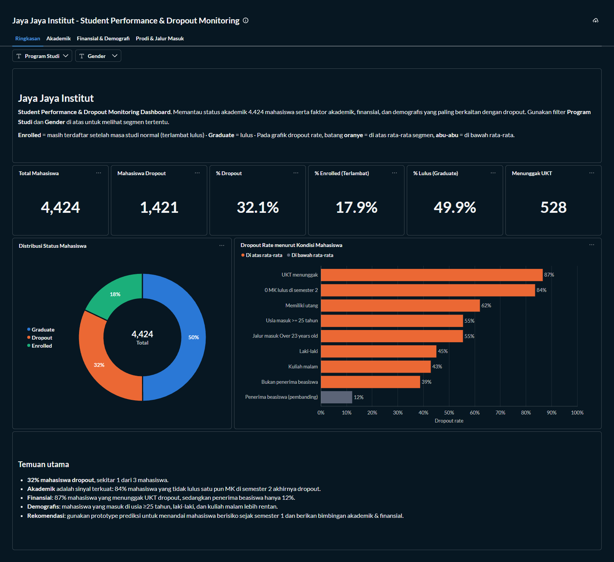
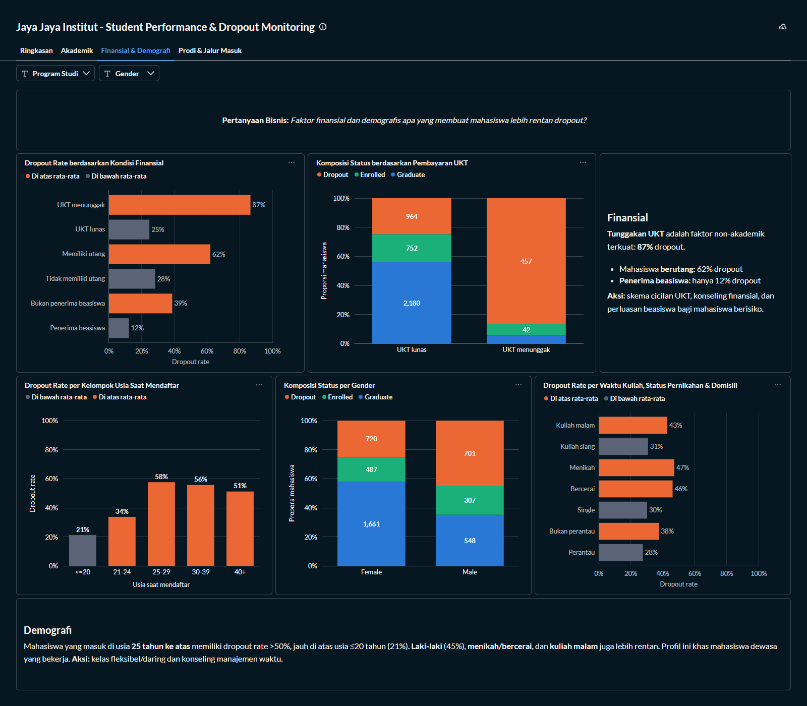
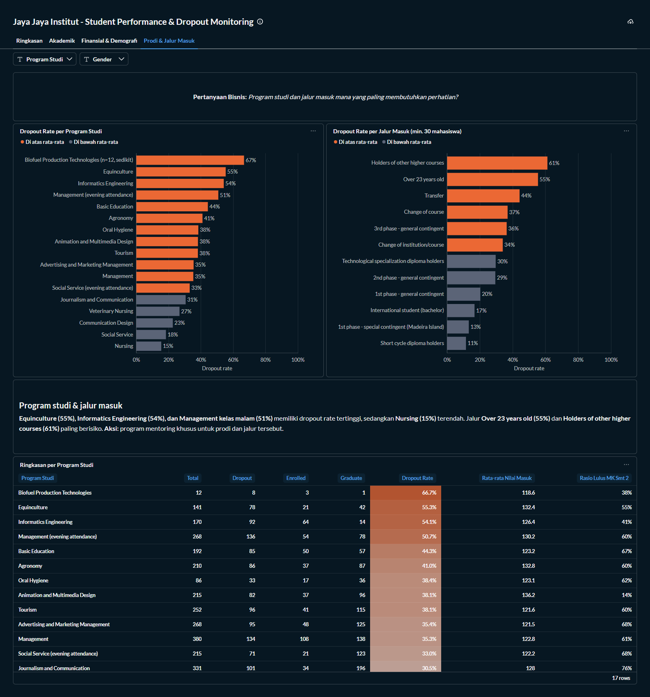

# Proyek Akhir: Menyelesaikan Permasalahan Perusahaan Edutech

## Business Understanding
Jaya Jaya Institut merupakan institusi pendidikan perguruan tinggi yang telah berdiri sejak tahun 2000 dan telah mencetak banyak lulusan dengan reputasi yang sangat baik. Akan tetapi, masih banyak mahasiswa yang tidak menyelesaikan pendidikannya atau dropout. Tingginya jumlah dropout menjadi masalah besar bagi institusi, baik dari sisi reputasi, akreditasi, maupun pendapatan.

Oleh karena itu, Jaya Jaya Institut ingin mendeteksi sedini mungkin mahasiswa yang berpotensi dropout agar dapat diberi bimbingan khusus. Selain itu, institusi membutuhkan dashboard untuk memahami data dan memonitor performa mahasiswa.

### Permasalahan Bisnis
1. Seberapa besar tingkat dropout mahasiswa di Jaya Jaya Institut?
2. Faktor apa saja (akademik, finansial, demografis, program studi, dan jalur masuk) yang paling berkaitan dengan dropout?
3. Bagaimana cara mendeteksi mahasiswa yang berisiko dropout sejak dini secara otomatis?
4. Bagaimana institusi dapat memonitor performa mahasiswa secara berkelanjutan?

### Cakupan Proyek
1. Melakukan data understanding dan exploratory data analysis (EDA) untuk mengidentifikasi faktor-faktor utama penyebab dropout.
2. Melakukan data preparation: seleksi 20 fitur, pembuatan fitur turunan (rasio kelulusan mata kuliah per semester), dan pipeline preprocessing.
3. Membangun model machine learning klasifikasi biner **Dropout (1) vs Graduate (0)** yang hanya dilatih pada mahasiswa dengan hasil akhir yang sudah diketahui (Dropout dan Graduate), membandingkan 4 algoritma, melakukan hyperparameter tuning, menentukan threshold, dan mengevaluasi model pada data uji.
4. Menggunakan model untuk memprediksi mahasiswa berstatus **Enrolled** yang dipisahkan sejak awal sebagai data prediksi di masa depan.
5. Membuat prototype sistem machine learning dengan Streamlit (EduGuard) dan men-deploy-nya ke Streamlit Community Cloud.
6. Membuat business dashboard dengan Metabase untuk memonitor faktor-faktor dropout.
7. Menyusun kesimpulan dan rekomendasi action items bagi Jaya Jaya Institut.

### Persiapan

Sumber data: [Students' Performance - Dicoding Academy](https://github.com/dicodingacademy/dicoding_dataset/tree/main/students_performance), yang berasal dari dataset UCI *Predict Students' Dropout and Academic Success* (Realinho dkk., 2021). Dataset berisi 4.424 mahasiswa dengan 36 fitur dan 1 target `Status` (Dropout, Enrolled, Graduate). Salinan data tersedia di `data/data.csv` dengan pemisah `;`.

Setup environment:
```
# 1. Buat virtual environment (Python 3.12)
python -m venv .venv

# 2. Aktifkan virtual environment
# Windows
.venv\Scripts\activate
# macOS / Linux
source .venv/bin/activate

# 3. Install library yang dibutuhkan
pip install -r requirements.txt

# 4. (Opsional) Jalankan ulang notebook untuk melatih model
#    dan menghasilkan data dashboard
jupyter notebook notebook.ipynb
```

Menjalankan notebook akan menghasilkan file berikut (seluruhnya sudah tersedia di folder submission):
- `model/dropout_model.joblib`: pipeline model (feature engineering, preprocessing, dan Gradient Boosting).
- `model/model_metadata.json`: threshold, metrik evaluasi, jumlah data, dan feature importance.
- `data/students_clean.csv` dan `data/students.db`: data berlabel seluruh mahasiswa untuk dashboard.
- `data/prediksi_enrolled.csv`: hasil prediksi risiko dropout untuk 794 mahasiswa Enrolled.
- `data/contoh_input_batch.csv`: contoh input untuk prediksi batch (25 mahasiswa Enrolled).

## Business Dashboard
Business dashboard dibuat menggunakan **Metabase** dengan judul **"Jaya Jaya Institut - Student Performance & Dropout Monitoring"**. Dashboard dilengkapi filter **Program Studi** dan **Gender** yang berlaku untuk seluruh grafik, serta terdiri dari 4 tab:

1. **Ringkasan**: KPI (total mahasiswa, jumlah dan persentase dropout, persentase enrolled, persentase graduate, jumlah mahasiswa menunggak UKT), distribusi status mahasiswa, dropout rate menurut kondisi mahasiswa, dan temuan utama.
2. **Akademik**: dropout rate berdasarkan jumlah mata kuliah (MK) yang lulus di semester 2, serta rata-rata MK lulus dan nilai semester per status.
3. **Finansial & Demografi**: dropout rate berdasarkan kondisi finansial (UKT, utang, beasiswa), komposisi status berdasarkan pembayaran UKT, serta dropout rate per kelompok usia, gender, waktu kuliah, status pernikahan, dan domisili.
4. **Prodi & Jalur Masuk**: dropout rate per program studi dan jalur masuk, serta tabel ringkasan per program studi.

Setiap tab diawali pertanyaan bisnis dan dilengkapi kartu insight berisi temuan serta rekomendasi aksi. Pada grafik dropout rate, batang berwarna oranye menandai kelompok dengan dropout rate di atas rata-rata segmen yang sedang difilter, sedangkan batang abu-abu berada di bawah rata-rata.

**Tab Ringkasan**



**Tab Akademik**


**Tab Finansial & Demografi**



**Tab Prodi & Jalur Masuk**



Akses Metabase:
- Email: `root@mail.com`
- Password: `root123`

Cara menjalankan dashboard (membutuhkan Docker), dari folder submission:
```
mkdir metabase-data
cp metabase.db.mv.db metabase-data/

docker run -d -p 3000:3000 -v "$(pwd)/metabase-data:/metabase.db" -v "$(pwd)/data:/data" --name metabase metabase/metabase:v0.63.18.5
```
Setelah container berjalan, buka `http://localhost:3000`, login dengan akun di atas, lalu buka dashboard pada menu *Our analytics*. Sumber data dashboard adalah `data/students.db` (SQLite) yang di-*mount* ke folder `/data` di dalam container. Di Windows PowerShell, gunakan `Copy-Item` sebagai pengganti `cp` dan `${PWD}` sebagai pengganti `$(pwd)`.

## Menjalankan Sistem Machine Learning
Prototype sistem machine learning bernama **EduGuard**, dibuat dengan Streamlit (`app.py`).

Ringkasan pemodelan:
- **Data pemodelan:** hanya mahasiswa yang hasil akhirnya sudah diketahui, yaitu 3.630 mahasiswa berstatus **Dropout** (1.421) dan **Graduate** (2.209). Target biner: 1 = Dropout, 0 = Graduate. Data dibagi 80% latih dan 20% uji secara *stratified*.
- **Mahasiswa Enrolled** (794) masih menempuh studi sehingga hasil akhirnya belum diketahui. Mereka **tidak dilibatkan dalam training maupun evaluasi**, melainkan dipisahkan sebagai data prediksi di masa depan.
- **Model:** **Gradient Boosting** dengan 20 fitur ditambah 2 fitur turunan (rasio kelulusan MK per semester), terpilih karena memiliki F1-score tertinggi dibanding Logistic Regression, Decision Tree, dan Random Forest. Threshold 0,49 dipilih agar recall minimal 80%.
- **Performa pada data uji:** recall 91,5%, precision 89,7%, F1-score 0,906, akurasi 92,6%, dan ROC-AUC 0,971.
- **Prediksi mahasiswa Enrolled:** 405 dari 794 mahasiswa (51%) berisiko Tinggi, 131 berisiko Sedang, dan 258 berisiko Rendah (`data/prediksi_enrolled.csv`).

Link prototype (Streamlit Community Cloud): https://eduguard-j.streamlit.app/

Cara menjalankan prototype secara lokal (setelah environment disiapkan):
```
streamlit run app.py
```

Aplikasi akan terbuka di `http://localhost:8501` dan memiliki 4 menu:
1. **Dashboard**: monitoring dropout per segmen dengan filter program studi, gender, dan waktu kuliah.
2. **Prediksi Individu**: mengisi data akademik, finansial, dan profil seorang mahasiswa. Aplikasi menampilkan:
   - probabilitas dropout dan tingkat risiko (Rendah < 25%, Sedang 25-49%, Tinggi ≥ 49%),
   - faktor yang paling memengaruhi prediksi,
   - rekomendasi tindak lanjut untuk dosen wali.

   Tombol *Isi contoh risiko rendah/tinggi* dapat digunakan untuk mencoba aplikasi dengan cepat.
3. **Prediksi Batch**: mengunggah file CSV berisi banyak mahasiswa sekaligus (template berisi 25 mahasiswa Enrolled tersedia di aplikasi dan di `data/contoh_input_batch.csv`), memfilter hasil per tingkat risiko, lalu mengunduh hasilnya.
4. **Tentang Model**: performa model, alur prediksi, dan pengaruh setiap fitur.

## Conclusion
1. **Tingkat dropout tinggi.** Sebanyak 32,1% mahasiswa (1.421 dari 4.424) dropout, atau sekitar 1 dari 3 mahasiswa. Sebanyak 17,9% masih terdaftar setelah masa studi normal (Enrolled, terlambat lulus) dan 49,9% lulus (Graduate).

2. **Faktor yang paling berkaitan dengan dropout:**
   - **Akademik (faktor terkuat):** 84% mahasiswa yang tidak lulus satu pun MK di semester 2 akhirnya dropout, dibandingkan 11% pada mahasiswa yang lulus 5-6 MK. Rata-rata mahasiswa dropout hanya lulus 2,6 MK di semester 1 dan 1,9 MK di semester 2, sedangkan mahasiswa yang lulus sekitar 6 MK. Jumlah MK lulus di semester 2 juga menjadi fitur paling berpengaruh pada model.
   - **Finansial:** dropout rate mahasiswa yang menunggak UKT mencapai 87% (vs 25% yang lunas) dan mahasiswa yang memiliki utang 62% (vs 28%). Sebaliknya, dropout rate penerima beasiswa hanya 12% (vs 39% non-penerima).
   - **Demografis:** mahasiswa yang masuk di usia 25 tahun ke atas memiliki dropout rate di atas 50% (vs 21% pada usia 20 tahun ke bawah). Laki-laki (45% vs 25% perempuan) dan mahasiswa kelas malam (43% vs 31% kelas siang) juga lebih rentan.
   - **Program studi dan jalur masuk:** dropout rate tertinggi terdapat pada Equinculture (55%), Informatics Engineering (54%), dan Management kelas malam (51%), sedangkan Nursing paling rendah (15%). Jalur Over 23 years old (55%) dan Holders of other higher courses (61%) paling berisiko.
   - Pendidikan orang tua dan kondisi makroekonomi (tingkat pengangguran, inflasi, GDP) tidak berpengaruh berarti.

3. **Deteksi dini dapat dilakukan secara otomatis.** Model Gradient Boosting yang dilatih pada mahasiswa Dropout dan Graduate mampu mendeteksi 91,5% mahasiswa yang akan dropout dengan precision 89,7% pada data uji (ROC-AUC 0,97). Tingkat risiko yang dihasilkan terbukti bermakna: dropout rate aktual pada data uji adalah 3,6% untuk risiko Rendah, 22,2% untuk Sedang, dan 89,7% untuk Tinggi. Saat diterapkan pada 794 mahasiswa Enrolled, model menandai **405 mahasiswa (51%) berisiko Tinggi** yang perlu segera ditindaklanjuti.

4. **Monitoring berkelanjutan** dapat dilakukan melalui dashboard Metabase dan menu Dashboard pada EduGuard, per program studi, gender, dan waktu kuliah.

### Rekomendasi Action Items
- **Tindak lanjuti segera 405 mahasiswa Enrolled berisiko Tinggi.** Gunakan daftar di `data/prediksi_enrolled.csv` (diurutkan dari probabilitas tertinggi) untuk menjadwalkan pertemuan dengan dosen wali, dimulai dari mahasiswa yang belum lulus MK di semester 2 atau menunggak UKT.
- **Terapkan sistem peringatan dini setiap akhir semester.** Jalankan prediksi batch EduGuard untuk seluruh mahasiswa aktif di akhir semester 1 dan 2. Mahasiswa berisiko Tinggi wajib bertemu dosen wali dalam 2 minggu, sedangkan risiko Sedang dipantau setiap bulan.
- **Lakukan intervensi akademik sejak semester 1.** Berikan bimbingan akademik intensif, kelas remedial, dan tutor sebaya bagi mahasiswa dengan rasio kelulusan MK di bawah 50% atau yang tidak lulus satu pun MK.
- **Tangani masalah finansial lebih awal.** Integrasikan data tunggakan UKT dari bagian keuangan ke sistem akademik, lalu tawarkan skema cicilan atau keringanan UKT serta konseling finansial bagi mahasiswa yang menunggak atau memiliki utang.
- **Perluas program beasiswa dan bantuan biaya**, diprioritaskan untuk mahasiswa berisiko tinggi dengan kendala finansial, mengingat dropout rate penerima beasiswa jauh lebih rendah.
- **Dukung mahasiswa dewasa dan kelas malam.** Sediakan jadwal yang fleksibel, opsi kelas daring atau hybrid, dan konseling manajemen waktu bagi mahasiswa berusia 25 tahun ke atas, jalur Over 23 years old, dan kelas malam.
- **Jalankan program mentoring khusus untuk program studi berisiko tinggi** (Equinculture, Informatics Engineering, Management kelas malam), disertai evaluasi kurikulum dan beban MK tahun pertama.
- **Lakukan monitoring dan evaluasi berkala.** Tinjau dashboard setiap semester untuk melihat dampak intervensi, dan latih ulang model setiap tahun dengan data terbaru agar prediksi tetap akurat.
