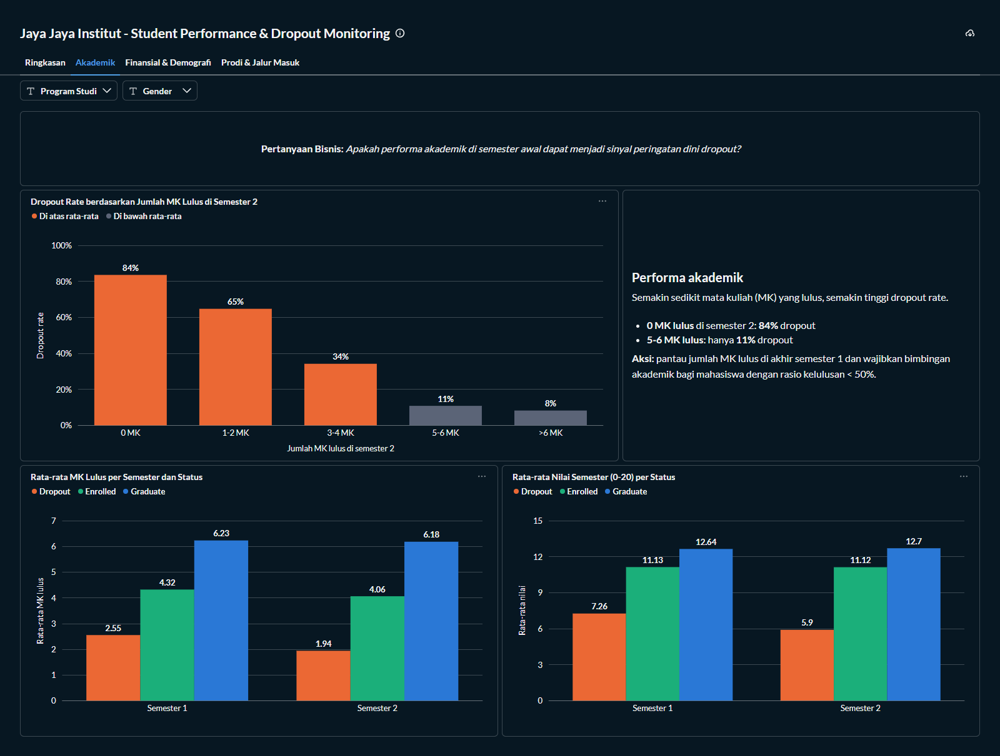

<div align="center">
  

  # EduGuard: Early Detection of Students at Risk of Dropping Out

  **Final Project, Belajar Penerapan Data Science (Dicoding) · Jaya Jaya Institut**

  [](https://www.python.org/)
  [](https://scikit-learn.org/)
  [](https://pandas.pydata.org/)
  [](https://streamlit.io/)
  [](https://plotly.com/python/)
  [](https://www.metabase.com/)
  [](https://www.docker.com/)

  [](https://eduguard-j.streamlit.app/)
</div>

> An early warning system that finds students at risk of **dropping out** before it is too late.
>
> The project covers an analysis of 4,424 Jaya Jaya Institut students, a machine learning model that predicts dropout risk (recall 92%, ROC-AUC 0.97), the **EduGuard** Streamlit prototype, and a **Metabase** business dashboard for monitoring the factors behind dropout.

---

## 📌 About the Project

| Detail | Description |
|---|---|
| **Institution (fictional)** | Jaya Jaya Institut |
| **Dataset** | Students' Performance: 4,424 students, 36 features, target `Status` (Dropout / Enrolled / Graduate) |
| **Model target** | Dropout (1) vs Graduate (0), trained on 3,630 students; 794 Enrolled students kept aside for prediction |
| **Model** | Gradient Boosting, 20 features + 2 engineered features, threshold 0.49 |
| **Performance (test set)** | Recall 91.5% · Precision 89.7% · F1 0.906 · Accuracy 92.6% · ROC-AUC 0.971 |
| **Prototype** | Streamlit (EduGuard), deployed to Streamlit Community Cloud |
| **Dashboard** | Metabase (SQLite as the data source) |

---

## 💼 Business Understanding

Jaya Jaya Institut is a higher education institution founded in 2000 that has produced many well-regarded graduates. However, the number of students who do not finish their studies (**dropout**) is still high. This hurts the institution's reputation, accreditation, and revenue, and it hurts the students themselves.

Jaya Jaya Institut wants to **detect students who are likely to drop out as early as possible** so they can receive targeted guidance, and it needs a dashboard to understand the data and monitor student performance.

### Business Problems

1. How high is the dropout rate at Jaya Jaya Institut?
2. Which factors (academic, financial, demographic, study program, and admission path) are most associated with dropout?
3. How can students at risk of dropping out be detected early and automatically?
4. How can the institution monitor student performance on an ongoing basis?

### Project Scope

| Stage | Output |
|---|---|
| **Data understanding & EDA** | Main drivers of dropout (`notebook.ipynb`) |
| **Data preparation** | Dropout + Graduate as modeling data (Enrolled set aside), selection of 20 features, course pass-rate features, preprocessing pipeline |
| **Modeling & evaluation** | Comparison of 4 algorithms, tuning, threshold selection, evaluation on the test set, prediction of Enrolled students |
| **Deployment** | **EduGuard** Streamlit prototype on Streamlit Community Cloud |
| **Business dashboard** | 4-tab Metabase dashboard with study program & gender filters |
| **Recommendations** | Conclusions and action items for the institution |

### Setup

**Data source:** [Students' Performance (Dicoding Academy)](https://github.com/dicodingacademy/dicoding_dataset/tree/main/students_performance), derived from the UCI dataset *Predict Students' Dropout and Academic Success* (Realinho et al., 2021). A copy is stored in `data/data.csv` (`;`-separated).

**Environment setup** (Python 3.12):

**1. Create and activate a virtual environment**
```bash
python -m venv .venv

# Windows
.venv\Scripts\activate
# macOS / Linux
source .venv/bin/activate
```

**2. Install dependencies**
```bash
pip install -r requirements.txt
```

**3. (Optional) Re-run the notebook**
```bash
jupyter notebook notebook.ipynb
```
> 💡 The notebook regenerates the model (`model/`), the dashboard data (`data/students_clean.csv`, `data/students.db`), the Enrolled predictions (`data/enrolled_predictions.csv`), and the sample batch input (`data/sample_batch_input.csv`). All of these files are already included, so this step is optional.

---

## 🗂️ Project Structure

```text
submission/
│
├── 📄 README.md                        # Project documentation (this file)
├── 📓 notebook.ipynb                   # Full data science process: EDA → modeling → evaluation
├── 🐍 app.py                           # Streamlit prototype (EduGuard)
├── 🐍 utils.py                         # Label mappings & feature engineering (shared by notebook and app)
├── 📄 requirements.txt                 # Dependencies
├── 🗄️ metabase.db.mv.db                # Metabase database containing the business dashboard
├── 🖼️ rainy1501-dashboard*.png         # Business dashboard screenshots (4 tabs)
│
├── 📁 data/
│   ├── data.csv                        # Original dataset
│   ├── students_clean.csv              # Labelled data (notebook output)
│   ├── students.db                     # SQLite database, the Metabase data source
│   ├── enrolled_predictions.csv        # Predicted dropout risk of the 794 Enrolled students
│   └── sample_batch_input.csv          # Template / sample input for batch prediction (25 Enrolled students)
│
├── 📁 model/
│   ├── dropout_model.joblib            # Pipeline: feature engineering + preprocessing + model
│   └── model_metadata.json             # Threshold, metrics, and feature importance
│
├── 📁 assets/                          # App CSS & logo
└── 📁 .streamlit/config.toml           # App theme
```

---

## 🔬 System Workflow

```
                     [ data/data.csv ]
               4,424 students · 36 features
                           │
                           ▼
                  [ notebook.ipynb ]
         EDA → preparation → modeling → evaluation
                           │
          ┌────────────────┴─────────────────┐
          ▼                                  ▼
[ model/dropout_model.joblib ]     [ data/students.db ]
  Gradient Boosting pipeline        labelled data (SQLite)
          │                                  │
          ▼                                  ▼
  [ EduGuard · Streamlit ]           [ Metabase Dashboard ]
  Dashboard · Single prediction      4 tabs · program & gender filters
  Batch prediction · About model     ← Port 3000
  ← Port 8501 / Streamlit Cloud
```

---

## 📊 Business Dashboard

The dashboard is built with **Metabase** and has 4 tabs (labels in Indonesian). The **Program Studi** (study program) and **Gender** filters apply to every chart.

| Tab | Contents |
|---|---|
| **Ringkasan** (Summary) | KPIs (total students, dropout count & rate, enrolled, graduate, overdue tuition), status distribution, dropout rate by student condition, key findings |
| **Akademik** (Academic) | Dropout rate by number of courses passed in semester 2, average courses passed and grades per status |
| **Finansial & Demografi** (Financial & Demographic) | Dropout rate by financial condition, status mix by tuition payment, dropout rate by age, gender, class time, and marital status |
| **Prodi & Jalur Masuk** (Program & Admission) | Dropout rate per study program and admission path, summary table per study program |

On the dropout-rate charts, **orange** bars mark groups whose dropout rate is **above the average** of the filtered segment, while **grey** bars are below average.


<details>
<summary><b>Show the other tabs</b></summary>




</details>

**Metabase access**

| | |
|---|---|
| **Email** | `root@mail.com` |
| **Password** | `root123` |

**Running the dashboard** (requires Docker)

```bash
# Run from this project folder
mkdir metabase-data
cp metabase.db.mv.db metabase-data/     # Windows PowerShell: Copy-Item metabase.db.mv.db metabase-data\

docker run -d -p 3000:3000 \
  -v "$(pwd)/metabase-data:/metabase.db" \
  -v "$(pwd)/data:/data" \
  --name metabase metabase/metabase:v0.63.18.5
```
> 💡 Open **http://localhost:3000**, log in with the account above, then open the **"Jaya Jaya Institut - Student Performance & Dropout Monitoring"** dashboard under *Our analytics*. On Windows PowerShell, replace `$(pwd)` with `${PWD}` and write the `docker run` command on a single line.

---

## 🤖 Running the Machine Learning System

The machine learning prototype is called **EduGuard** and is built with Streamlit.

**🔗 Live prototype:** [https://eduguard-j.streamlit.app](https://eduguard-j.streamlit.app/)

**Run locally** (after the *Setup* steps):
```bash
streamlit run app.py
```
> 💡 The app opens at **http://localhost:8501**. Use the *Fill low-risk / high-risk example* buttons in the Single Prediction tab for a quick try.

### Main Features

| Feature | Details |
|---|---|
| **Dashboard** | Dropout monitoring per segment, filterable by study program, gender, and class time |
| **Single Prediction** | Dropout probability and risk level (**Low** < 25%, **Medium** 25–49%, **High** ≥ 49%), the factors that drive the prediction, and recommendations for academic advisors |
| **Batch Prediction** | Upload a CSV of many students (template with 25 Enrolled students in `data/sample_batch_input.csv`), filter by risk level, download the results |
| **About the Model** | Model performance, prediction flow, and the influence of each feature |

### Model

| Aspect | Description |
|---|---|
| **Algorithm** | Gradient Boosting (100 trees, depth 3, learning rate 0.1), highest F1-score compared with Logistic Regression, Decision Tree, and Random Forest |
| **Training data** | Only students whose final outcome is known: 3,630 **Dropout** (1,421) and **Graduate** (2,209) students, split 80/20 (stratified) |
| **Target** | Dropout (1) vs Graduate (0) |
| **Enrolled students** | The 794 *Enrolled* students are still studying, so their outcome is unknown. They are **not used for training or evaluation** and are predicted as future data: 405 High, 131 Medium, 258 Low risk |
| **Features** | 20 features (semester 1–2 academics, finances, profile, admission) + 2 engineered features (course pass rate per semester) |
| **Threshold** | 0.49, the highest-F1 threshold with recall of at least 80% |
| **Performance (test set)** | Recall 91.5% · Precision 89.7% · F1 0.906 · Accuracy 92.6% · ROC-AUC 0.971 |
| **Risk-level validation** | Actual dropout rate on the test set: Low 3.6% · Medium 22.2% · High 89.7% |

---

## ✅ Conclusion

1. **The dropout rate is high.** **32.1% of students (1,421 of 4,424) dropped out**, roughly 1 in 3. Another 17.9% were still enrolled after the normal study period (graduating late) and 49.9% graduated.

2. **Factors most associated with dropout:**

   | Factor | Finding |
   |---|---|
   | **Academic** (strongest) | **84%** of students who passed no courses in semester 2 eventually dropped out, vs 11% of those who passed 5–6 courses. Dropouts passed only 2.6 courses (sem 1) and 1.9 courses (sem 2) on average, while graduates passed about 6. |
   | **Financial** | Overdue tuition: **87%** dropped out (vs 25% of those paid up). Debtors: **62%** (vs 28%). Scholarship holders: only **12%** (vs 39%). |
   | **Demographic** | Enrolled at age ≥ 25: **> 50%** (vs 21% at age ≤ 20). Men 45% (vs 25% of women). Evening classes 43% (vs 31% daytime). |
   | **Program & admission path** | Highest: Equinculture (55%), Informatics Engineering (54%), Management (evening) (51%). Lowest: Nursing (15%). The *Over 23 years old* (55%) and *Holders of other higher courses* (61%) paths carry the most risk. |
   | **No meaningful effect** | Parents' education and macroeconomic conditions (unemployment, inflation, GDP) |

3. **Early detection can be automated.** Trained on Dropout and Graduate students, the model catches **91.5% of students who will drop out** with 89.7% precision. Its risk levels are meaningful: the actual dropout rate is 3.6% (Low), 22.2% (Medium), and 89.7% (High). Applied to the 794 Enrolled students, it flags **405 (51%) as High risk**.

4. **Ongoing monitoring** is possible through the Metabase dashboard and the Dashboard tab in EduGuard, by study program, gender, and class time.

### 🎯 Recommended Action Items

| # | Action | Details |
|---|---|---|
| 1 | **Follow up on the 405 High-risk Enrolled students now** | Use `data/enrolled_predictions.csv` (sorted by probability) to schedule advisor meetings, starting with students who passed no courses in semester 2 or are behind on tuition. |
| 2 | **Early warning at the end of every semester** | Run EduGuard batch prediction for all active students at the end of semesters 1 and 2. *High*-risk students meet their academic advisor within 2 weeks; *Medium*-risk students are checked monthly. |
| 3 | **Academic intervention from semester 1** | Intensive mentoring, remedial classes, and peer tutoring for students with a course pass rate below 50% or no courses passed. |
| 4 | **Address financial problems early** | Link tuition arrears data to the academic system; offer instalment plans or tuition relief and financial counselling to students who are behind on tuition or in debt. |
| 5 | **Expand scholarships** | Prioritise high-risk students with financial constraints, since scholarship holders drop out far less often. |
| 6 | **Support mature & evening students** | Flexible schedules, online/hybrid class options, and time-management counselling for students aged ≥ 25, the *Over 23 years old* path, and evening classes. |
| 7 | **Mentoring for high-risk programs** | Dedicated mentoring and a first-year curriculum review for Equinculture, Informatics Engineering, and Management (evening). |
| 8 | **Regular monitoring & evaluation** | Review the dashboard every semester to measure the impact of interventions, and retrain the model yearly with the latest data. |

---

## 📋 Submission Checklist

**Required criteria**
- [x] Uses the project template (`notebook.ipynb`, `README.md`)
- [x] Complete data science process: business understanding → data understanding → preparation → modeling → evaluation → deployment
- [x] Metabase business dashboard + `metabase.db.mv.db` + access credentials
- [x] Machine learning prototype built with Streamlit and deployed to Streamlit Community Cloud
- [x] Conclusions and recommended action items

**Suggestions**
- [x] Every stage documented with *text cells* in the notebook, including insights from each analysis
- [x] Effective data visualisation: consistent, colour-blind-safe palette, axes starting at zero, values labelled directly on charts
- [x] Prototype with a clean, easy-to-use UI
- [ ] Explanation video (max 5 minutes)

---

## 📄 Data Source

Realinho, V., Vieira Martins, M., Machado, J., & Baptista, L. (2021). *Predict Students' Dropout and Academic Success*. UCI Machine Learning Repository. https://doi.org/10.24432/C5MC89

*Jaya Jaya Institut is a fictional name used for this Dicoding learning project.*
